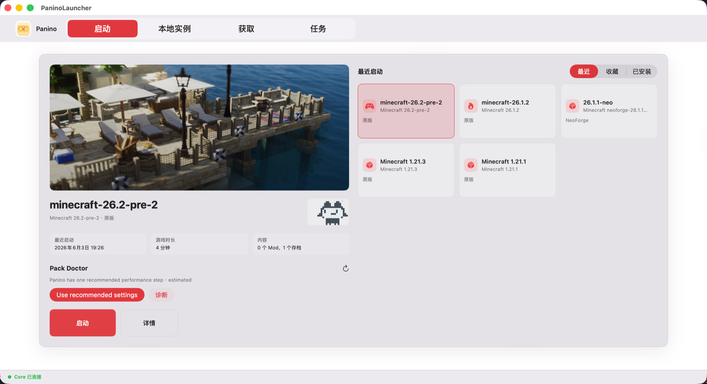
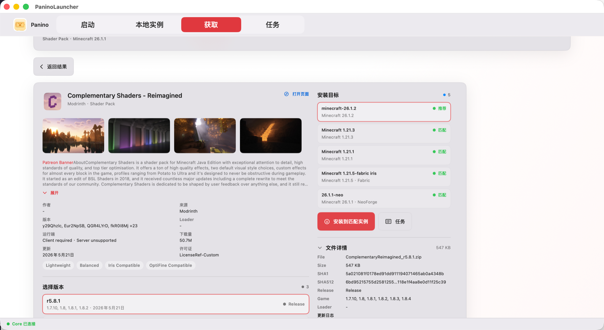
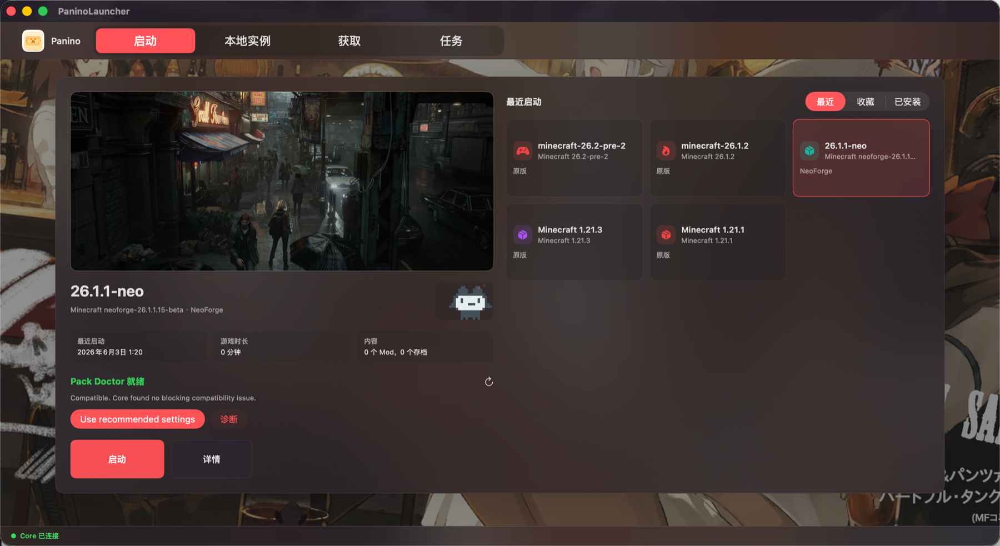
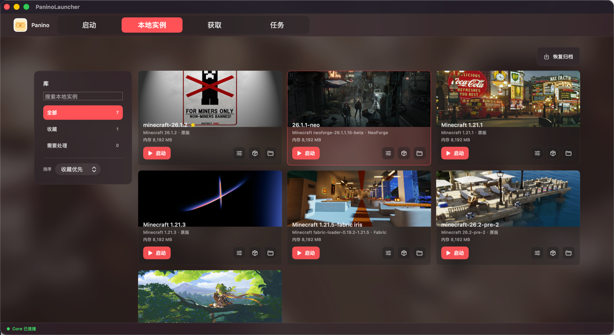
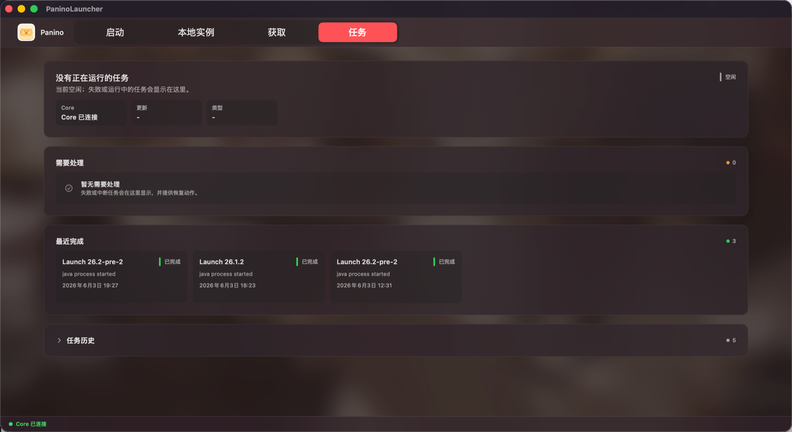
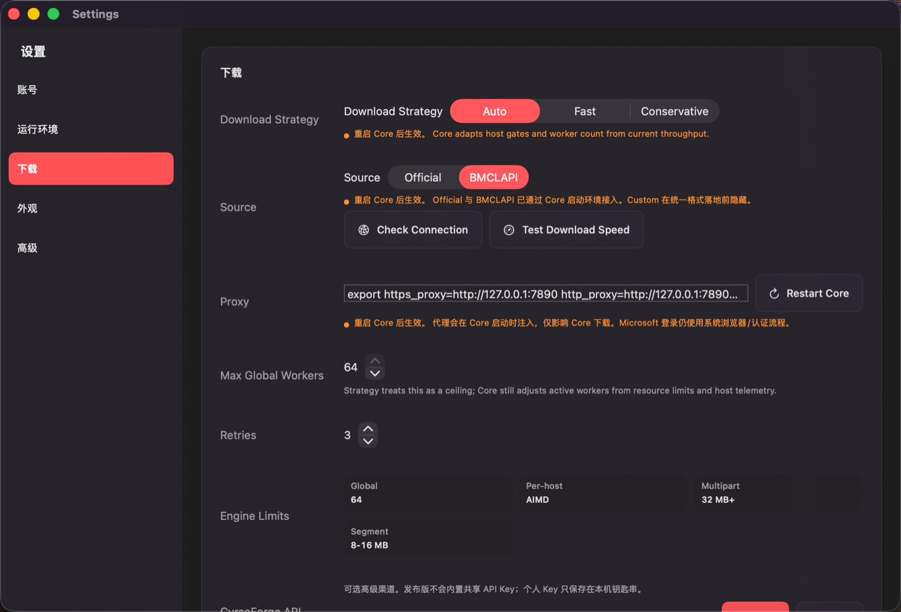

<p align="center">
  
</p>

# Panino Launcher

<p align="center">
  <a href="README.md">中文</a> | <a href="README.en.md">English</a> | Italiano
</p>

> [!WARNING]
> **关于 AI 辅助开发的赛博判决书 / The AI Verdict**
>
> 叮咚！听好了，各位代码纯洁圣母和键盘判官：本项目确实疯狂摄入了 AI 科技工业糖精，不过别慌，核心架构和代码已经由本大人亲自拿皮鞭 Review 并调教测试完毕。
> 别急着破防，你行你来同时把 **Haskell (硬核函数式 FP)** 和 **Swift (花心面向对象 OOP)** 强行塞进一个解耦架构里？在两个完全极端的脑回路之间疯狂来回劈叉，那酸爽的心智负担让人欲罢不能。在这种高强度的精神污染下，靠 AI 拯救我濒临坏掉的脑细胞，属于完全合法的紧急避险！
> 如果您对 AI 极度过敏，或者自我膨胀到想来对老子指点江山——那么这位*坚持古法纯手工敲打无添加老代码的大神*，右上角点叉，您己开个仓库从零手敲去吧。祝您早日用指甲盖在远古打孔纸带上抠出属于你的传世经典。**别下载，也别来 Issue 区展示你贫瘠的脑容量。** 本开源项目纯属个人无偿奉献，爱用不用，别指望我给你们提供什么好脸色，Roll（滚）！

Panino è un launcher per Minecraft Java Edition dedicato solo a macOS. Architettura SwiftUI + Haskell Core.

È ancora una community Alpha, non un prodotto finito. Farà errori, mostrerà confini non ancora sistemati e in molti punti sembrerà ancora giovane. Ma almeno non è più soltanto un guscio grafico: Core installa il gioco, pianifica i download, gestisce i loader, registra i task, esegue diagnostica e comincia a provare a rispondere a una domanda più concreta:

> Se Minecraft deve girare su un Mac serie M, il launcher può fare qualcosa in più di offrire qualche parametro predefinito?

<p align="center">
  
</p>

## Che Cos'è?

Lo scheletro di Panino è semplice:

```text
SwiftUI macOS App
  -> avvia panino-core in locale
  -> API REST/SSE su localhost
  -> Haskell Core installa, scarica, verifica, diagnostica e genera argomenti di avvio
  -> SwiftUI si iscrive agli eventi dei task e restituisce lo stato all'utente
```

Non voglio davvero che la UI giri portandosi dietro tutta la complessità. La parte difficile di un launcher Minecraft spesso sta più in basso: i metadati upstream cambiano, il loader installer non spiega perché fallisce, una dipendenza mod funziona solo con una certa versione, la versione Java e l'architettura del sistema non sono adatte, oppure una sorgente di download diventa improvvisamente lenta nel pomeriggio. Panino Core esiste proprio per questo lavoro sporco.

## Cosa Può Già Fare

- Avviare un Haskell Core locale e proteggere l'API localhost con bearer token.
- Installare Minecraft Vanilla, scaricando e verificando client, libraries, assets e natives.
- Installare Fabric, Quilt, Forge, NeoForge, e costruire un percorso di risoluzione automatico per shader loader come Iris/Oculus.
- Registrare lo stato delle istanze locali con cartelle istanza isolate e `.panino/instance.json`.
- Cercare contenuti Modrinth / CurseForge e analizzare modelli di progetto, versione, file e dipendenza.
- Mantenere stato dei task, cronologia task e stream eventi SSE.
- Scansionare e controllare Java, portando avanti installazione/selezione/verifica dei runtime gestiti.
- Gestire scheduling download, source probe, multipart, diagnostica rete e record di throughput.
- Iniziare a costruire tuning Apple Silicon, JVM tuning, graphics tuning, catena di evidenze prestazionali, typed install plan e lockfile.

## Cosa Non È Ancora Fatto Bene

- Pacchetti di installazione stabili, firma Developer ID, notarizzazione e aggiornamenti automatici non hanno ancora raggiunto lo standard di una release stabile.
- Il ciclo import/export di `.mrpack` / zip CurseForge deve ancora essere rifinito.
- Aggiornamenti mod, risoluzione conflitti, analisi crash log e suggerimenti di riparazione sono ancora poco maturi.
- Microsoft login ha già una base implementata, ma servono ancora test di livello release, logout/revoke e recupero errori.
- L'export diagnostico richiede una policy unica di redazione più severa.
- Il tuning Apple Silicon deve parlare con dispositivi reali, modpack reali ed evidenze di rollback, non può basarsi solo su impostazioni predefinite carine.

## Screenshot

<table>
  <tr>
    <td></td>
    <td></td>
  </tr>
  <tr>
    <td><sub>Contenuti online, corrispondenza versioni e destinazioni di installazione.</sub></td>
    <td><sub>Pagina di avvio e stato Pack Doctor con temi diversi.</sub></td>
  </tr>
  <tr>
    <td></td>
    <td></td>
  </tr>
  <tr>
    <td><sub>Libreria istanze locali. Ogni istanza dovrebbe avere il proprio confine.</sub></td>
    <td><sub>Centro task. Errori e completamenti non dovrebbero sparire in silenzio.</sub></td>
  </tr>
  <tr>
    <td colspan="2"></td>
  </tr>
  <tr>
    <td colspan="2"><sub>Sorgenti download, proxy, concorrenza e strategia rete del Core.</sub></td>
  </tr>
</table>

## Direzioni Adatte Ai Contributi

Se vuoi solo guardare un launcher finito, qui potrebbe essere ancora presto. Se invece vuoi smontare un launcher e vedere come diventa lentamente software affidabile, ci sono ancora molti posti liberi.

- Haskell Core: risoluzione dipendenze, lockfile solver, typed install plan, structured diagnostics, property tests.
- SwiftUI macOS: interazione nativa, gestione istanze, visualizzazione diagnostica, pagina impostazioni, centro task, accessibilità e localizzazione.
- Ecosistema Minecraft: installazione loader, import/export modpack, compatibilità Modrinth / CurseForge, crash log e analisi conflitti di dipendenza.
- Apple Silicon: parametri JVM, impostazioni grafiche, campionamento performance, strategia di rollback e validazione con modpack reali.
- Release engineering: firma, notarizzazione, aggiornamenti automatici, audit privacy, redazione pacchetti diagnostici e flusso community beta.

Molto benvenuti! 🎉

## Build

Servono macOS 14+, Swift 6 toolchain / Xcode, GHC, Cabal e Java 17 o Java 21 per eseguire Minecraft.

Dalla radice del repository:

```sh
./scripts/test-core.sh
./scripts/build-core.sh
./scripts/build-swift.sh
./scripts/smoke-test.sh
git diff --check
```

Verifica rete e download:

```sh
./scripts/benchmark-core-network.sh
./scripts/verify-core-network-matrix.sh
```

Se l'ambiente di rete richiede un proxy:

```sh
https_proxy=http://127.0.0.1:7890 \
http_proxy=http://127.0.0.1:7890 \
all_proxy=socks5://127.0.0.1:7891 \
./scripts/test-core.sh
```

Core CLI:

```sh
cd core
cabal run panino-core -- --version
cabal run panino-core -- health
cabal run panino-core -- install --version 1.20.1 --game-dir /tmp/panino-minecraft --concurrency 16
cabal run panino-core -- serve --host 127.0.0.1 --port 8080 --session-token dev-token
```

App macOS:

```sh
cd macos/PaninoLauncher
swift build
swift run PaninoLauncher
```

## Struttura Del Repository

```text
core/                         Haskell panino-core: API, installazione, download, diagnostica, core di avvio
macos/PaninoLauncher/         App macOS SwiftUI: UI, stato, processo Core e client API
companion/                    Direzione opzionale per companion in-game
scripts/                      Script di build, test, smoke e verifica rete
docs/                         Mappa progetto, checklist sviluppo, analisi competitiva e release trust
assets/readme/                Immagini del README
LICENSE                       Testo della licenza Apache-2.0
NOTICE.md                     Avviso su attribuzione, nome e confini trademark
```

## Note Durante Lo Sviluppo

- Core si lega di default solo a `127.0.0.1`; l'API richiede bearer token.
- Swift gestisce il ciclo di vita del Core tramite `CoreProcessManager`.
- Informazioni sensibili come Microsoft refresh token e CurseForge API key devono entrare in Keychain.
- Prima di pubblicare issue, log o pacchetti diagnostici, confermare che non ci siano `access_token`, `refresh_token`, `api_key`, `Authorization`, `--session-token` o `/Users/<name>/`.
- Quando si cambia la Core API, di solito bisogna sincronizzare tipi API Haskell, route, Swift `LauncherApiClient`, `CoreModels` e Store/UI collegati.

## Licenza E Attribuzione

Questo progetto è open source sotto Apache License 2.0. Puoi usare, modificare e distribuire il codice, ma devi rispettare `LICENSE` e `NOTICE.md`.

Requisiti principali:

1. Conservare l'attribuzione Panino in `NOTICE.md`.
2. Versioni derivate modificate e redistribuite devono cambiare nome e Logo del progetto.
3. Non far credere agli utenti che una versione derivata sia la versione ufficiale di Panino.

Apache-2.0 non concede il permesso di usare il nome Panino, il Logo o altri segni identificativi del progetto come trademark. I confini su nome e Logo sono definiti da `NOTICE.md`.

